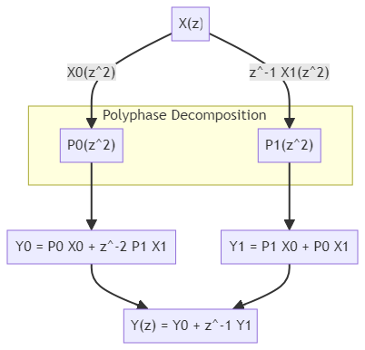

# ssr-multistage-decimator

Hardware design and FPGA-based implementation of a super sample rate multistage decimator using Vitis High-Level Synthesis. The HLS component is synthesized from C++ functions into RTL code for implementation in the programmable logic (PL) region of a Versal Adaptive SoC , Zynq MPSoC, or AMD FPGA device. The generated RTL code is exported as a packaged IP for use in the Vivado Design Suite.

## Super-Sample Rate Filters

When the required sample frequency is greater than the clock frequency, the filter must be designed to accept multiple input samples and to compute multiple parallel output samples every clock cycle. The number of parallel samples is determined by calculating the ratio of between the sample frequency and clock frequency.

## Directory Structure

- `doc/`: Documentation files and design specifications.
- `hw/`: Hardware design sources including source code, IPs, and constraints.
  - `src/`: C++ source files for the HLS design.
  - `tb/`: Testbench files
- `matlab/`: MATLAB models and scripts for signal generation and verification
- `data/`: Input signals and simulation outputs
- `scripts/`: Automation scripts like TCL scripts, Makefiles, etc.
- `prj_ssr_multistage_decimator/`: Vitis HLS project

## Signal Processing Details

The input signal is sampled at a rate of 1280 Mega-Samples Per Second (MSPS). The system clock driving this process works at a frequency of 160 MHz. The design supports multiple decimation factors: 1, 2, 4, 8, 16, 32, and 64. Depending on the chosen decimation factor, the output signal sampling rate will vary accordingly. Below are the output rates for each decimation factor:

| Decimation Factor | Output Rate (MSPS) |
|-------------------|--------------------|
| 1                 | 1280               |
| 2                 | 640                |
| 4                 | 320                |
| 8                 | 160                |
| 16                | 80                 |
| 32                | 40                 |
| 64                | 20                 |

### Anti-Aliasing Low-Pass Filter Specifications

The anti-aliasing low-pass filter is a half-band filter (HBF) designed using the DSP Matlab toolbox, and with the following specifications:

- **Passband Frequency (`Fpass`)**: 
- **Stopband Frequency (`Fstop`)**: 
- **Passband Ripple**: `0.01 dB`
- **Stopband Attenuation (`att`)**: `60 dB`

The filter is symmetric with order 30, and only 17 coefficients are different from zero. The decimation filters frequency response are available in the `doc\` folder.

### Decimation Factor Selection

Select the appropriate decimation factor based on the input signal bandwidth, according to the following table:

| Bandwidth [MHz] | Dec Factor | Fpass   | Fstop |
|-----------------|------------|---------|-------|
| 1000            | 1          | NA      | NA    |
| 500             | 2          | 250     | 390   |
| 250             | 4          | 125     | 195   |
| 125             | 8          | 62.5    | 97    |
| 62.5            | 16         | 31.25   | 48    |
| 31.25           | 32         | 15.625  | 24    |
| 15.625          | 64         | 7.8125  | 12    |

## Hardware Architecture

The ssr_multistage_decimator is implemented as a cascade of half-band decimator-by-2 filters.

| Stage      | Input Rate | Output Rate | Decimation Factor | SSR |
|------------|------------|-------------|-------------------|-----|
| dec2_ssr8  | 1280       | 640         | 2                 | 8   |
| dec2_ssr4  | 640        | 320         | 4                 | 4   |
| dec2_ssr2  | 320        | 160         | 8                 | 2   |
| dec2       | 160        | 80          | 16                | 1   |
| dec2       | 80         | 40          | 32                | 1   |
| dec2       | 40         | 20          | 64                | 1   |

The first 3 stages are Super-Sample Rate (SSR) filters, designed to process multiple samples per clock cycle, which is required by the very high input sampling rate.

### Polyphase Decomposition

The parallel processing capability of these SSR filters is achieved through a technique known as polyphase decomposition. In polyphase decomposition, the filter is divided into several sub-filters, each processing a different set of samples. This allows the system to handle multiple samples simultaneously, effectively increasing the processing speed.

The diagram below illustrate how the input X(z) is decomposed into its polyphase components and then processed through the polyphase filters P0 and P1 to produce the output Y(z), for the case of SSR = 2.



- `X(z)` is the Z-transform of the input signal, which is decomposed into two components: `X0(z^2)` and `z^-1*X1(z^2)`.
- These components are fed into two polyphase filters: `P0` and `P1`.
- The outputs of these filters are then combined to form `Y0` and `Y1`.
  - `Y0` is calculated as `P0*X0 + z^-2*P1*X1`.
  - `Y1` is calculated as `P1*X0 + P0*X1`.
- Finally, `Y(z)` is the sum of `Y0` and `z^-1*Y1`, representing the output of the polyphase decomposition.

The polyphase decomposition for SSR = 4 is given as:
$$
Y_0 = P_0X_0 + (z^{-4})(P_3X_1 + P_2X_2 + P_1X_3)
$$
$$
Y_1 = P_1X_0 + P_0X_1 + (z^{-4})(P_3X_2 + P_2X_3)
$$
$$
Y_2 = P_2X_0 + P_1X_1 + P_0X_2 + (z^{-4})P_3X_3
$$
$$
Y_3 = P_3X_0 + P_2X_1 + P_1X_2 + P_0X_3
$$

The polyphase strucvture for SSR = 8 is described in the source file `dec_filters.h`

### Systolic Multiply-Accumulate Architecture

The implementation of these filters on an FPGA is based on a systolic Multiply-Accumulate (MAC) architecture. The MMAC processing units are connected in a chain and implement a pipelined Direct-Form filters. The architecture is directly supported by the DSP Slice and results in area-efficient and high performance filter implementations.

## Interface

### S_AXILITE Interfaces

| Interface     | Data Width | Address Width | Offset | Register |
|---------------|------------|---------------|--------|----------|
| s_axi_control | 32         | 5             | 16     | 0        |

### S_AXILITE Registers

| Interface     | Register   | Offset | Width | Access | Description               |
|---------------|------------|--------|-------|--------|---------------------------|
| s_axi_control | dec_factor | 0x10   | 32    | W      | Data signal of dec_factor |

### I/O Ports

| Port      | Direction | Bitwidth | Description         |
|-----------|-----------|----------|---------------------|
| tdata_i   | in        | 256      | 32-bits I/Q input samples, 8 samples |
| tdata_o   | out       | 256      | 32-bits I/Q output samples, 8 samples  |
| tvalid_i  | in        | 1        | valid input data  |
| tvalid_o  | out       | 1        | valid output data |

### TOP LEVEL CONTROL

| Interface | Type         | Ports    |
|-----------|--------------|----------|
| ap_clk    | clock        | ap_clk   |
| ap_rst_n  | reset        | ap_rst_n |

## Integration Guidelines

### Generating the IP Core Using Vitis HLS

To integrate the ssr-multistage-decimator in your design, simply execute the `run.tcl` script located in the top folder. This script sets up and runs synthesis and implementation, configures project settings, device settings, adds source and testbench files, specifies the top module, and adjusts clock settings.

- Use the command `vitis_hls -f run.tcl` for non-interactive mode.
- For interactive mode, enter `vitis_hls -i`, then type `source run.tcl`.
- Alternatively, use `vitis-run --mode hls --tcl run.tcl`.

### Default Setting

```tcl
set Project     prj_ssr_multistage_decimator
set Solution    solution_0
set Device      "xczu28dr-ffvg1517-2-e"
set Flow        ""
set ClockFreq   160       ;# Set the desired clock frequency in MHz
set Uncertainty 0.3
```

## Implementation Results

## Simulation

This section provides instructions on how to run simulations using the provided MATLAB scripts.

### Create Input and Reference Signals

The MATLAB scripts `tb_run.m` and `tb_run_all.m` are used to generate input and output reference signals for the simulation of the system. `tb_run.m` is responsible for running a single simulation, while `tb_run_all.m` executes all simulations in a batch process.

To generate the reference signals, follow these steps:

1. Open MATLAB and navigate to the directory containing `tb_run.m` and `tb_run_all.m`.
2. Run a single simulation by executing the following command in the MATLAB Command Window:

   ```matlab
   tb_run
   ```

3. Choose usecase (a)

4. Follow the instructions displayed on Matlab.

5. To run all simulations, execute this command instead:

   ```matlab
   tb_run_all
   ```

These scripts create an instance of the Matlab class `MatlabTestBench.m` and call its methods. Alternatively, the user can create the testbench object directly.

### Run C/RTL Simulation

#### Executing the `run_csim.tcl` Script

The `run_csim.tcl` script automates the simulation process for the `ssr_multistage_decimator`. It handles test setup, including copying necessary files, running clean simulations, and copying results back to the designated directories. This script ensures correct project handling and execution of different simulation stages such as C simulation and co-simulation.

#### Usage Instructions

1. Open Vitis HLS in interactive mode `vitis_hls -i`
2. Type `source run_csim.tcl`.

#### Script Configuration

- The script allows for the selection of single or multiple test cases. This is controlled by the `selection` variable within the script:

```tcl
set selection "single"
set selection "multi"
```

for a single test case or for multiple test cases.

- The script initializes with the option to reset the project data:

```tcl
set resetProject false
```

It defines whether to run C simulation (`CSIM`) and co-simulation (`COSIM):

```tcl
set CSIM true
set COSIM true
```

#### Test Case Selection Procedure

The script includes a procedure setTestcases for setting the test cases based on the selection variable. This procedure returns a list of test case names depending on whether single or multi is selected.

### Validate Results

To validate a single simulation, executing the following command in the MATLAB Command Window:

   ```matlab
   tb_run
   ```

1. Choose usecase (b)

2. Follow the instructions displayed on Matlab.

## Synthesis and Implementation
